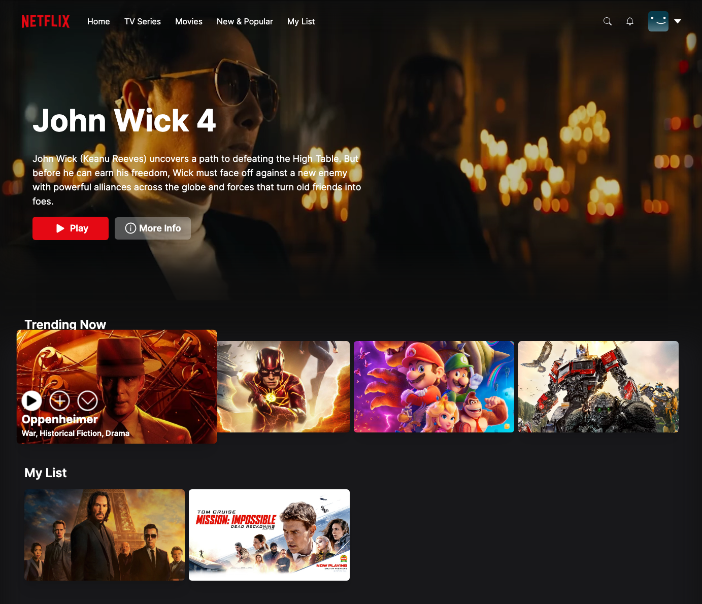
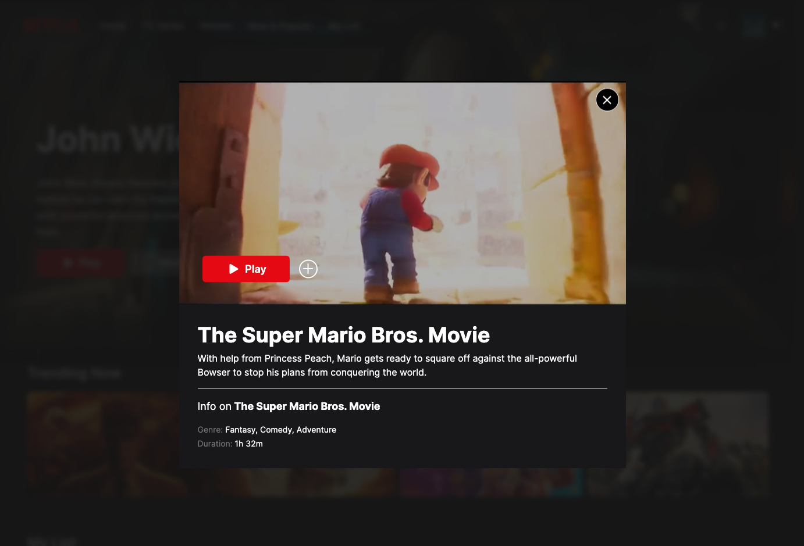

# Netflix Clone App (Next.js)

## Introduction

This is a Netflix clone web app created using Next.js, a React framework for server-side rendering and building modern web applications. The app replicates the core functionalities of Netflix, allowing users to browse and stream movies and TV shows. The app utilizes Framer Motion for smooth animations and transitions. User authentication is implemented using NextAuth with Google and GitHub providers. The app uses MongoDB as the database for storing data.

## Features

- User Authentication: Users can sign up or log in to their accounts using their Google or GitHub credentials.
- Home Page: Display a curated selection of popular movies and TV shows.
- Paginated Rows: Movies and TV shows are organized into paginated rows, allowing users to scroll through different categories.
- Movie Details: Users can view detailed information about a specific movie or TV show.
- Watchlist: Users can add movies and TV shows to their watchlist for later viewing.
- Responsive Design: The app is optimized for various screen sizes and devices.

## Demo

You can access the live demo of the app at [https://netflix-clone-kpirabaharan.vercel.app/](https://netflix-clone-kpirabaharan.vercel.app/).

- Feel free to use the anonymous account linked to a dummy email address.
- Or you can use your own email address.

## Technologies Used

- Next.js: React framework for server-side rendering and building web applications
- React: JavaScript library for building user interfaces
- Framer Motion: Animation and motion library for smooth transitions
- NextAuth: Authentication library for Next.js applications
- Google and GitHub providers: Authentication providers for NextAuth
- MongoDB: Database for storing app data
- Tailwind CSS: Utility-first CSS framework for styling

## Screenshots

### Home Page

### Info Modal

## License

This project is licensed under the [MIT License](https://opensource.org/licenses/MIT).

## Contact

If you have any questions or suggestions, please feel free to reach out to us:

- Email: kpirabaharan3@gmail.com
- LinkedIn: [https://linkedin.com/in/kpirabaharan/](https://linkedin.com/in/kpirabaharan/)

---

Feel free to customize and expand the readme based on your project's specific requirements. Include any additional sections such as testing, deployment instructions, or acknowledgments.
